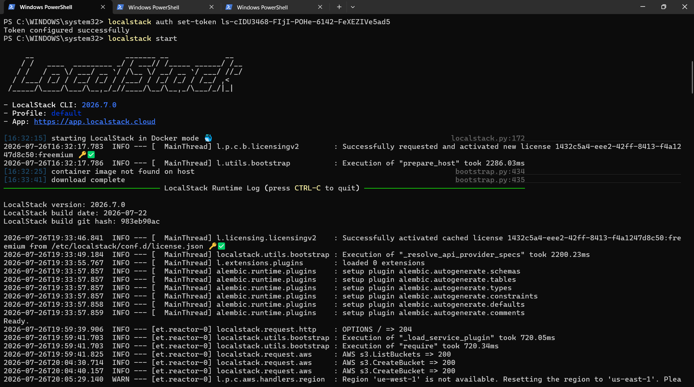
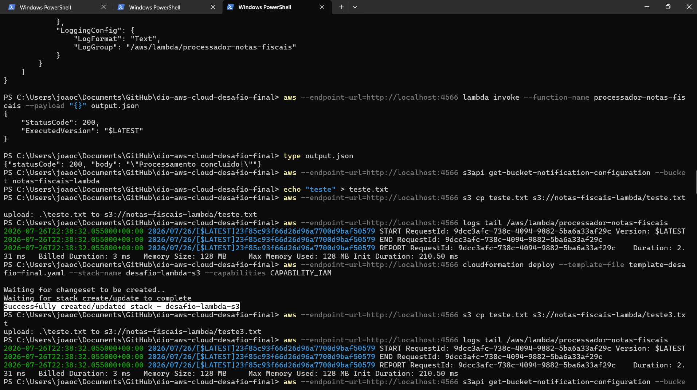
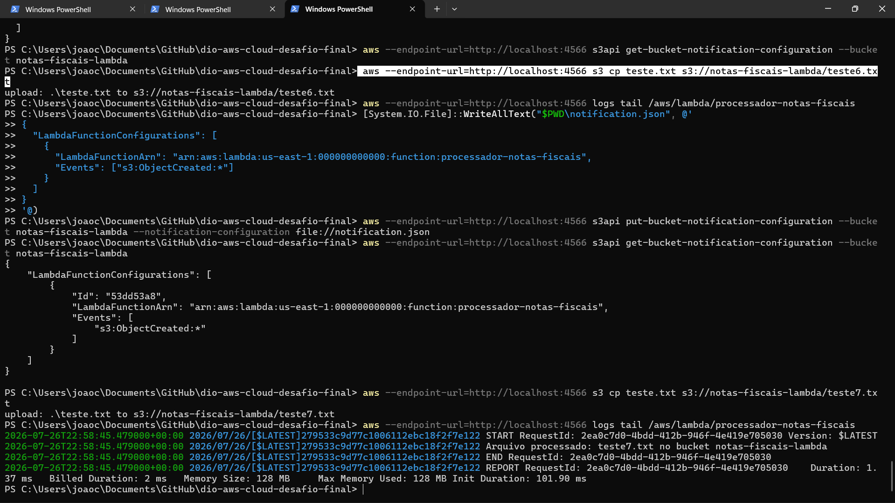
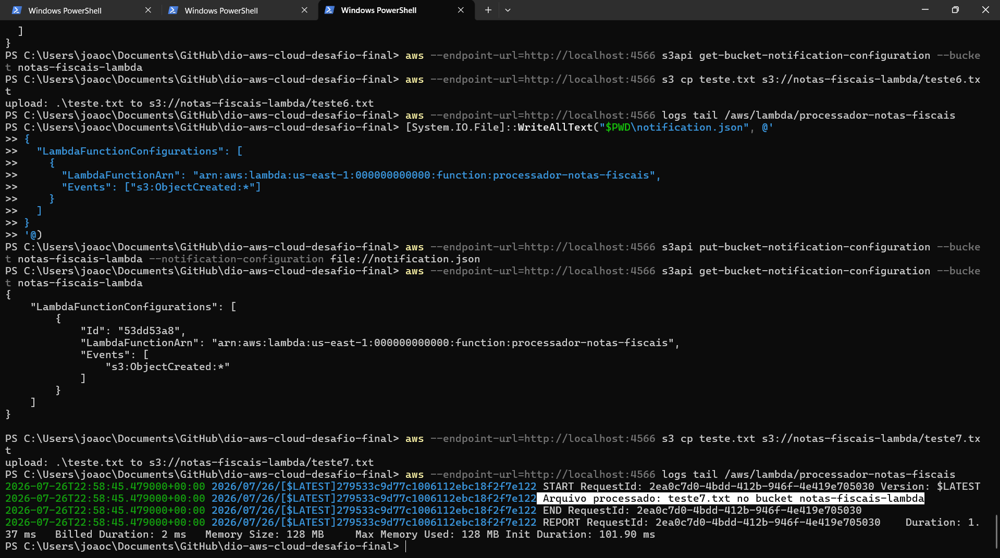

# Desafio 03 - Projeto de Automação de Infraestrutura com AWS CloudFormation
Repositório do terceiro desafio do curso Cloud com AWS da [DIO](https://www.dio.me/). O objetivo foi consolidar os conhecimentos em automação de infraestrutura com AWS CloudFormation, praticando desde stacks simples (EC2, S3) até cenários mais completos envolvendo rede, segurança e tarefas automatizadas com Lambda Function e S3. A prática foi feita localmente, utilizando LocalStack e Docker para simular o ambiente AWS.
## O que eu aprendi

* CloudFormation: permite criar e gerenciar recursos de infraestrutura através de templates (código), garantindo padronização e replicação de ambientes.
* Lambda Function: serviço de computação serverless que executa código em resposta a eventos (como uploads em um bucket S3), sem necessidade de gerenciar servidores.
* Integração S3 + Lambda: possibilita automatizar tarefas (ex: processar, validar ou transformar arquivos) assim que eles são enviados a um bucket.
* LocalStack: ferramenta que simula os serviços da AWS localmente dentro de um container Docker, permitindo testar templates do CloudFormation sem custos e sem precisar de uma conta AWS real.

## Arquitetura
Diagrama representando os recursos provisionados pelo template (bucket S3, Lambda Function e permissões associadas):

## O que eu fiz na prática

1. Configurei o ambiente local: Docker, WSL2, LocalStack CLI e autenticação com Auth Token (comando `localstack start` mostrando o banner e a licença `freemium` ativada)

2. Criei o template CloudFormation com o bucket S3, a Lambda Function, a Role e a permissão de invocação

3. Fiz o deploy da stack no LocalStack via linha de comando (`aws cloudformation deploy ...` terminando em `Successfully created/updated stack - desafio-lambda-s3`)

4. Configurei manualmente a notificação do bucket S3 para acionar a Lambda (`aws s3api put-bucket-notification-configuration ...`), já que o CloudFormation do LocalStack não aplica essa propriedade automaticamente

5. Testei o fluxo de automação: upload de um arquivo no bucket S3 (`aws s3 cp teste.txt s3://notas-fiscais-lambda/...`) disparando a execução da Lambda Function

6. Verifiquei os logs da Lambda (`aws logs tail /aws/lambda/processador-notas-fiscais`) confirmando o processamento do arquivo, com a linha `Arquivo processado: teste7.txt no bucket notas-fiscais-lambda`

## Minhas impressões
A maior dificuldade não foi o CloudFormation em si, mas configurar todo o ambiente local: instalar Docker, habilitar o WSL2, configurar o Python/pip corretamente no PATH do Windows e, principalmente, lidar com a exigência recente da LocalStack de criar uma conta e gerar um Auth Token mesmo para uso gratuito (community). Outro ponto interessante foi descobrir que o LocalStack aceita a propriedade `NotificationConfiguration` do S3 dentro do template do CloudFormation sem erro, mas não a aplica de fato — foi preciso configurar essa notificação manualmente via CLI (`put-bucket-notification-configuration`) para o gatilho funcionar. Isso mostrou na prática que simuladores locais não têm 100% de paridade com a AWS real, e a importância de testar cada parte do fluxo em vez de assumir que o template sozinho resolve tudo. Também ficou mais evidente como a integração entre S3 e Lambda funciona (evento de criação de objeto acionando a função). Pretendo usar esse conhecimento para testar e validar infraestruturas antes de aplicá-las em uma conta AWS real, reduzindo custos durante o desenvolvimento.

## Referências

* [Automatizar a configuração do S3 Object Lambda com um modelo do CloudFormation - Documentação da AWS](https://docs.aws.amazon.com/pt_br/AmazonS3/latest/userguide/olap-cloudformation.html)
* [Documentação do LocalStack](https://docs.localstack.cloud/)

Feito durante o curso Cloud com AWS da [DIO](https://www.dio.me/).